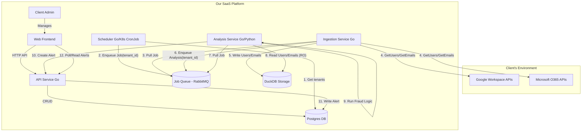

# Email Ingestion

# Description



### **Overview**

This diagram represents a multi-tenant SaaS platform that integrates with **Google Workspace** and **Microsoft 365** environments to collect, analyze, and alert on user or email data (e.g., for fraud detection). It’s composed of multiple Go/Python services coordinated via APIs, databases, and a job queue.

### **1. Client’s Environment**

* **Google Workspace APIs (GAPI)** and **Microsoft O365 APIs (MAPI)**
  These are external APIs owned by the client’s organization.
  They provide access to user and email data that the SaaS platform will ingest and analyze.

### **2. Our SaaS Platform**

#### **Frontend and API Layer**

* **Client Admin → Web Frontend (FE)**
  The client admin uses a web interface to configure tenants, view results, and manage settings.

* **Web Frontend → API Service (Go)**
  The frontend communicates with a backend API service over HTTP to perform actions (CRUD operations) such as managing tenants, users, and alerts.

* **API Service → Postgres DB (PDB)**
  The API service reads and writes structured data—like tenant configurations, job states, and alerts—to the PostgreSQL database.

#### **Background Processing Pipeline**

1. **Scheduler (Go / Kubernetes CronJob)**

   * Periodically runs to fetch a list of tenants from PostgreSQL (`1. Get tenants`).
   * For each tenant, it enqueues a job in the **Job Queue (RabbitMQ)** (`2. Enqueue Job(tenant_id)`).

2. **Ingestion Service (Go)**

   * Pulls jobs from RabbitMQ (`3. Pull Job`).
   * Uses the **Google Workspace APIs** and **Microsoft 365 APIs** to retrieve data (`4. GetUsers/GetEmails`).
   * Writes the raw or normalized user/email data into **DuckDB** (`5. Write Users/Emails`).
   * After successful ingestion, it enqueues a new analysis job for that tenant (`6. Enqueue Analysis(tenant_id)`).

3. **Analysis Service (Go/Python)**

   * Pulls analysis jobs from RabbitMQ (`7. Pull Job`).
   * Reads user and email data in read-only mode from **DuckDB** (`8. Read Users/Emails (RO)`).
   * Runs fraud detection or anomaly detection logic (`9. Run Fraud Logic`).
   * Creates an alert when suspicious activity is found (`10. Create Alert`).

4. **Alert Creation and Notification**

   * The **Analysis Service** communicates with the **API Service** to register new alerts (`10 → API`).
   * The **API Service** writes those alerts into PostgreSQL (`11. Write Alert`).
   * The **Frontend** periodically polls the API to display the latest alerts to the client admin (`12. Poll/Read Alerts`).

---

### **3. Data Storage Components**

* **PostgreSQL (PDB)**: Stores tenant metadata, configurations, alerts, and API-managed records.
* **DuckDB (DDB)**: Holds ingested analytical data (users, emails) optimized for read-heavy workloads during analysis.
* **RabbitMQ (JQ)**: Manages asynchronous communication between Scheduler, Ingestion, and Analysis services.

---

### **In Summary**

* The system continuously ingests data from Google/Microsoft APIs per tenant.
* It stores the data in DuckDB for efficient analytical queries.
* The analysis service processes this data, flags suspicious behavior, and generates alerts.
* Alerts flow back through the API to the frontend for the client admin to review.

## Local dev build

```bash
export CGO_ENABLED=1
export DUCKDB_PATH="/data/security.db"
mkdir -p /data
go mod tidy
go build -v -o /ingestion-service ./cmd
```


### clean dependencies

```bash
rm go.mod go.sum
go mod init main
go mod tidy
```

## Tests

```bash
export CGO_ENABLED=1
# Test DB
go test -run ^TestDuckDBRepository_InitSchema$ main/internal/storage
go test -run ^TestDuckDBRepository_SaveAndGetUsers$ main/internal/storage
go test -run ^TestDuckDBRepository_GetLastSyncTime$ main/internal/storage

# Test service ingestion
go test -run ^TestService_SyncTenant_Success$ main/internal/ingestion
go test -run ^TestService_SyncTenant_ProviderError$ main/internal/ingestion
```

## Container

```bash
docker-compose up --build
```

## Perspective

- Use apache flight for data syncronisation and data api for data scientist and data enginer
- Use apache flight SQL for sql read/write access to postgres